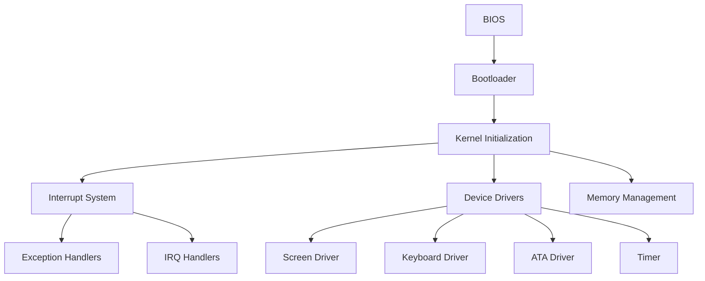

# Oslab

A minimal x86 operating system written in C and Assembly.

## Overview

Oslab is a minimal operating system for x86 architecture, developed using C and Assembly languages. The project aims to provide a simple and efficient operating system that can be used for educational purposes and experimentation in low-level system programming.

This OS implements core operating system functionalities including:
- A custom bootloader that loads the kernel into memory
- Protected mode operation with GDT implementation
- Interrupt handling system with IDT
- Basic device drivers for screen, keyboard, and disk
- Memory management utilities
- Real-time clock functionality

## Architecture



## Features

- **Boot Process**: Custom bootloader that transitions from 16-bit real mode to 32-bit protected mode
- **Kernel**: Main kernel written in C with Assembly entry point
- **Interrupt Handling**: Complete interrupt descriptor table (IDT) implementation with handlers for CPU exceptions and hardware interrupts
- **Memory Management**: Basic memory allocation and string manipulation utilities
- **Device Drivers**:
  - VGA text mode screen driver
  - PS/2 keyboard driver with scancode translation
  - ATA PIO mode disk driver
  - Programmable Interval Timer (PIT) driver
  - Real-time clock (RTC) implementation
- **User Interface**: Simple command-line interface for interacting with the system

## Project Structure

```
.
├── boot/           # Bootloader assembly code
├── cpu/            # CPU-specific code (interrupts, ports, timer)
├── drivers/        # Device drivers (screen, keyboard, ATA, sound)
├── kernel/         # Main kernel implementation
├── libc/           # Basic C library functions (memory, string operations)
├── Makefile        # Build configuration
├── linker.ld       # Linker script
└── README.md       # Project documentation
```

### Bootloader (boot/)

The bootloader is responsible for loading the kernel into memory and transitioning the CPU from 16-bit real mode to 32-bit protected mode. It includes:

- `bootsect.asm`: Main bootloader code that loads the kernel from disk
- `gdt.asm`: Global Descriptor Table implementation for protected mode
- `switch_pm.asm`: Code to switch to protected mode
- `disk.asm`: Disk reading functions using BIOS interrupts
- `print.asm`: Text printing functions for real mode
- `32bit_print.asm`: Text printing functions for protected mode
- `print_hex.asm`: Hexadecimal number printing utility

### Kernel (kernel/)

The main kernel implementation that runs in 32-bit protected mode:

- `kernel.c`: Entry point and main kernel functions
- `kernel.h`: Kernel header file

### CPU Management (cpu/)

CPU-specific functionality for low-level system operations:

- `idt.c/h`: Interrupt Descriptor Table implementation
- `isr.c/h`: Interrupt Service Routines
- `interrupt.asm`: Assembly interrupt handlers
- `ports.c/h`: Hardware port I/O functions
- `timer.c/h`: Timer and real-time clock implementation
- `type.h`: Custom type definitions

### Device Drivers (drivers/)

Hardware device drivers for system peripherals:

- `screen.c/h`: VGA text mode display driver
- `keyboard.c/h`: PS/2 keyboard driver
- `ata.c/h`: ATA disk driver for reading/writing sectors
- `sound.c/h`: PC speaker sound driver
- `pci.c`: PCI bus detection (incomplete)

### Standard Library (libc/)

Basic C library functions for kernel use:

- `mem.c/h`: Memory manipulation functions
- `string.c/h`: String manipulation functions
- `function.h`: Utility macros

## Build Instructions

### Prerequisites

- NASM (Netwide Assembler)
- GCC cross-compiler for i386 (i386-elf-gcc)
- GNU Make
- QEMU (for testing)

### Building

```bash
make
```

This will generate:
- `bootsect.bin`: The compiled bootloader
- `kernel.bin`: The compiled kernel
- `os-image.bin`: The complete OS image ready to run

### Running

To run the OS in QEMU:

```bash
make run
```

To debug with GDB:

```bash
make debug
```

### Cleaning

To clean build artifacts:

```bash
make clean
```

## Usage

After booting, the system will display a prompt:

```
martin@root: 
```

Available commands:
- `HALT`: Halts the CPU
- `SEC`: Displays current date and time
- `S`: Sleeps for 5 seconds
- `W1`: Reads a sector from the disk (ATA driver test)

## Technical Details

### Boot Process

1. BIOS loads the bootloader (bootsect.bin) into memory at 0x7C00
2. Bootloader sets up the stack and prints status messages
3. Bootloader loads the kernel from disk to memory address 0x1000
4. Bootloader sets up the Global Descriptor Table (GDT)
5. Bootloader switches CPU to 32-bit protected mode
6. Control is transferred to the kernel entry point

### Memory Layout

- Bootloader: Loaded at 0x7C00
- Kernel: Loaded at 0x1000
- Stack: Set up at 0x90000
- Video Memory: 0xB8000 (VGA text mode)

### Interrupt Handling

The OS implements a complete interrupt handling system:
- 32 CPU exceptions (0-31)
- 16 Hardware IRQs (32-47)
- Custom handlers for keyboard input (IRQ1) and timer (IRQ0)

### Device Drivers

#### Screen Driver
- Direct VGA memory access at 0xB8000
- Text mode output (80x25 characters)
- Color attribute support
- Cursor positioning and scrolling

#### Keyboard Driver
- PS/2 keyboard scancode translation
- Support for basic ASCII characters
- Backspace and enter key handling
- Input buffering

#### ATA Driver
- PIO mode disk access
- Sector reading functionality
- Status register polling

#### Timer Driver
- Programmable Interval Timer (PIT) configuration
- Real-time clock using CMOS
- Sleep functionality

## Contributing

Contributions are welcome! Please feel free to submit a Pull Request.

Areas for improvement:
- File system implementation
- Memory management improvements
- Additional device drivers
- Process scheduling
- Virtual memory support

## License

This project is licensed under the MIT License - see the [LICENSE](LICENSE) file for details.

## Acknowledgments

- This project is based on various OS development tutorials and resources
- Inspired by the work of the open-source community in low-level system programming
